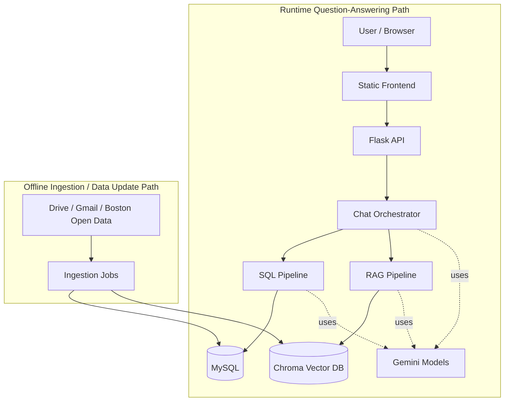
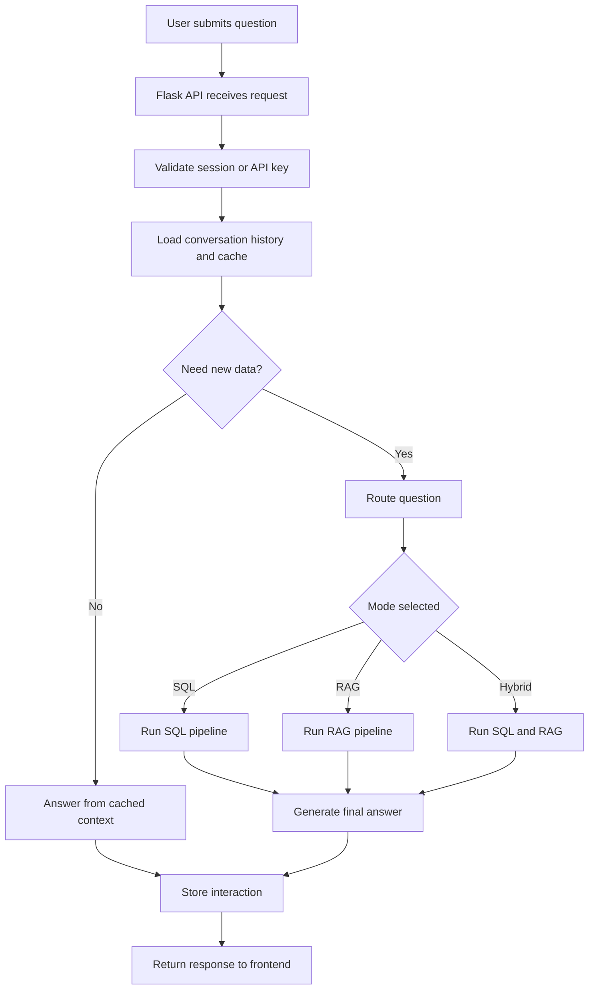

# System Design Document

## Overview

RethinkAI is a Dorchester-focused community assistant that answers user questions by combining:

- **SQL queries** over structured data such as Boston 311 records, 911/public safety data, and community events
- **RAG retrieval** over unstructured documents such as policy reports, transcripts, newsletters, and community notes
- **LLM orchestration** to decide which data path to use and to generate a user-friendly answer

The system is designed to support both factual questions like “What events are happening this weekend?” and interpretive questions like “What do residents say about safety?”

## High-Level Architecture

## Main Components

### 1. Frontend

The frontend is a static web interface in `public/` that sends user messages to the Flask backend and displays responses, sources, and events. It is lightweight and easy to deploy because it does not require a build-heavy framework for core usage.

### 2. API Layer

The backend API in [`api/api_v2.py`](/Users/atharvgulati/Desktop/BU%20Spring%2026%20Assignments/CS%20549/ml-misi-community-sentiment/api/api_v2.py) is responsible for:

- authentication and session handling
- conversation and message storage
- chat request handling
- event retrieval
- admin and moderation endpoints

It supports both authenticated user sessions and a legacy API-key flow for compatibility.

### 3. Chat Orchestrator

The orchestrator in [`on_the_porch/unified_chatbot.py`](/Users/atharvgulati/Desktop/BU%20Spring%2026%20Assignments/CS%20549/ml-misi-community-sentiment/on_the_porch/unified_chatbot.py) is the core logic layer. It:

- checks whether a follow-up question can be answered from recent cached context
- routes the question to `sql`, `rag`, or `hybrid`
- executes the chosen data path
- merges results into one final answer

This layer is what makes the system a real hybrid assistant rather than a single retrieval tool.

### 4. SQL Pipeline

The SQL path in [`on_the_porch/sql_chat/app4.py`](/Users/atharvgulati/Desktop/BU%20Spring%2026%20Assignments/CS%20549/ml-misi-community-sentiment/on_the_porch/sql_chat/app4.py) handles structured questions, especially:

- event and schedule queries
- counts, trends, and comparisons
- public-safety and 311 analytics

It works by:

1. reading the live MySQL schema
2. generating SQL with Gemini
3. executing and retrying if needed
4. summarizing the results in plain language

### 5. RAG Pipeline

The RAG path in [`on_the_porch/rag stuff/retrieval.py`](/Users/atharvgulati/Desktop/BU%20Spring%2026%20Assignments/CS%20549/ml-misi-community-sentiment/on_the_porch/rag%20stuff/retrieval.py) handles document-based questions, especially:

- policy interpretation
- meeting transcript questions
- neighborhood news and newsletter content
- community/admin knowledge

It uses:

- Gemini embeddings
- Chroma as the vector database
- metadata filters for source, document type, and tags

If semantic retrieval fails, it falls back to keyword-based retrieval.

## Request Flow

When a user submits a question, the system follows this process:

1. The frontend sends the message to the Flask API.
2. The API validates the session or API key.
3. The orchestrator checks whether recent cached context is enough.
4. If new retrieval is needed, the router selects `sql`, `rag`, or `hybrid`.
5. The selected pipeline runs and returns evidence.
6. The orchestrator generates the final answer.
7. The API stores the interaction and returns the response to the frontend.

### Chat Flowchart

## Data Architecture

The system uses two main storage layers because the data has two very different shapes.

### MySQL

MySQL stores structured and operational data such as:

- 311 data
- 911/public safety data
- extracted community events
- users, sessions, threads, and messages
- interaction logs and moderation data

MySQL is a good fit here because these datasets need exact filtering, time-based queries, and aggregation.

### Chroma Vector DB

Chroma stores unstructured text such as:

- policy documents
- community transcripts
- newsletters
- uploaded documents
- admin/community notes

Chroma is a good fit because these sources are better searched semantically than with exact SQL filtering.

## Data Ingestion Pipeline

The ingestion system in `on_the_porch/data_ingestion/` keeps the data sources up to date.

Its main inputs are:

- Google Drive documents
- Gmail/newsletter content
- Boston open data and community sources

Its outputs are:

- **MySQL** for structured event and city data
- **Chroma** for searchable document content

This hybrid ingestion design matches the runtime architecture: structured data goes to SQL, and narrative text goes to vector search.

## Deployment and Infrastructure

The current system is designed to run with a simple deployment stack:

- static frontend
- Flask API
- MySQL database
- Chroma vector store on disk
- Gemini API for generation and embeddings

The repo also includes demo and DreamHost deployment scripts, which makes the system easy to run in a class, evaluation, or lightweight hosted environment.

## Strengths

- Supports both analytical and document-based questions
- Uses the right storage layer for each data type
- Keeps conversation context through cached retrieval state
- Includes moderation, admin knowledge, and community note workflows
- Has a practical ingestion pipeline instead of relying on static demo data only

## Limitations

- Legacy cache is in-memory, so it does not scale cleanly across multiple API instances
- The system depends heavily on Gemini for routing, SQL generation, and answer synthesis
- Chroma is currently file-based, which is fine for small deployments but weaker for larger production scaling
- Data freshness depends on scheduled ingestion running reliably

## Recommended Future Improvements

- move cache storage to Redis
- use a centralized or managed vector database for scale
- add stronger monitoring and data-freshness alerts
- harden production security with stricter CORS, HTTPS-only cookies, and rate limiting

## Conclusion

RethinkAI uses a hybrid architecture because no single retrieval method is enough for this problem. SQL is best for exact event and city-data questions, while RAG is best for documents and community narratives. The orchestrator ties these together into one conversational system that is practical, extensible, and well aligned with the project’s Dorchester community focus.
